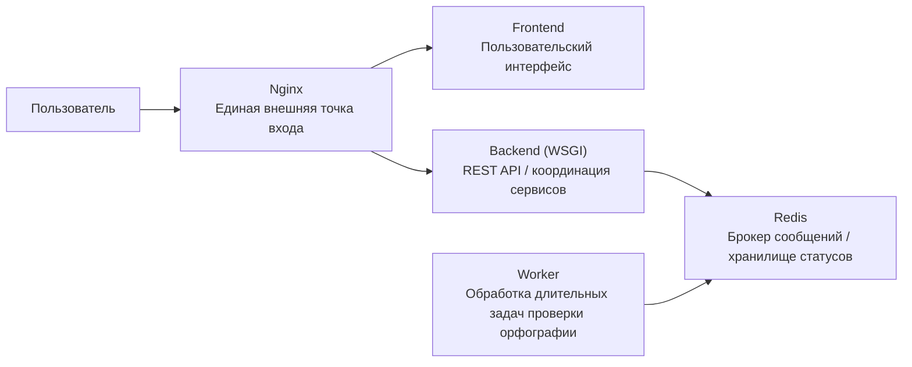
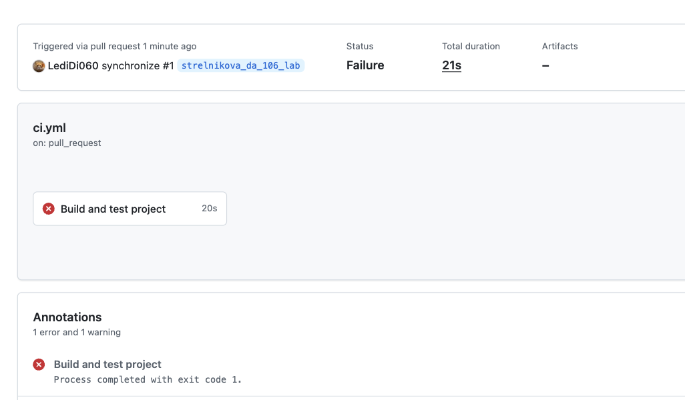

# Сервис проверки орфографии

Готовый учебный проект под требования Practice105.

## Что делает приложение

Пользователь открывает веб-интерфейс, вводит текст на русском и/или английском языке и запускает проверку. Проверка выполняется **асинхронно** через отдельный сервис `worker`, а статус задачи отображается на фронтенде в реальном времени.

## Архитектура

Сервисы:

- **gateway** — Nginx, единственная внешняя точка входа (`http://localhost:8080`)
- **frontend** — статический пользовательский интерфейс
- **backend** — Flask WSGI API, принимает запросы от фронтенда и проксирует их в worker
- **worker** — отдельный сервис длительных задач, выполняет проверку орфографии в фоне

## Схема микросервисов



Схема взаимодействия:

1. Пользователь открывает приложение через `gateway`.
2. `gateway` отдаёт статический `frontend` и проксирует API-запросы в `backend`.
3. `backend` создаёт задачу проверки орфографии в `worker` по сети Docker Compose.
4. `worker` асинхронно выполняет длительную задачу и сохраняет результат.
5. Frontend периодически опрашивает статус задачи через `backend` до получения результата.

## Стек

- Frontend: HTML, CSS, JavaScript
- Backend: Python + Flask + Gunicorn
- Worker: Python + Flask + ThreadPoolExecutor
- Gateway: Nginx
- Контейнеризация: Docker Compose

## Запуск

Из каталога `StrelnikovaDA/`:

```bash
docker compose up --build
```

После запуска приложение доступно по адресу:

```text
http://localhost:8080
```

## Использование

1. Откройте браузер.
2. Вставьте текст в поле.
3. Нажмите **Проверить орфографию**.
4. Дождитесь завершения фоновой задачи.
5. Посмотрите:
   - исправленный текст
   - список найденных ошибок
   - рекомендации по замене

## Поддерживаемые языки

- Русский
- Английский
- Смешанный режим (`auto`)

## Структура проекта

```text
StrelnikovaDA/
├── backend/
├── frontend/
├── gateway/
├── worker/
├── docker-compose.yml
└── readme.md
```

## API

### Создать задачу проверки

```http
POST /api/tasks/spellcheck
Content-Type: application/json
```

Тело:

```json
{
  "text": "Превет мир",
  "language": "auto"
}
```

Ответ:

```json
{
  "task_id": "...",
  "status": "queued"
}
```

### Получить статус задачи

```http
GET /api/tasks/<task_id>
```

## Примечания

- Worker специально выполняет задачу с задержкой, чтобы было видно асинхронную обработку.
- Для проверки орфографии используются встроенные hunspell-словари для русского и английского языков.


## Лабораторная работа 106. Continuous Integration

### Цель

Настроить процесс автоматического тестирования входящих изменений при pull request в главную ветку репозитория.

### Описание проекта

В качестве проекта используется сервис проверки орфографии из лабораторной работы 105.

Проект состоит из нескольких сервисов:

- `gateway` — Nginx, единая точка входа;
- `frontend` — пользовательский интерфейс;
- `backend` — Flask API;
- `worker` — сервис фоновой проверки орфографии;
- `docker-compose.yml` — описание сборки и запуска микросервисов.

### Используемая CI/CD-платформа

Для CI используется GitHub Actions.

Workflow расположен в файле:

```text
.github/workflows/ci.yml

### Скриншоты выполнения CI/CD процесса

#### Успешное выполнение


#### Выполнение с ошибкой

