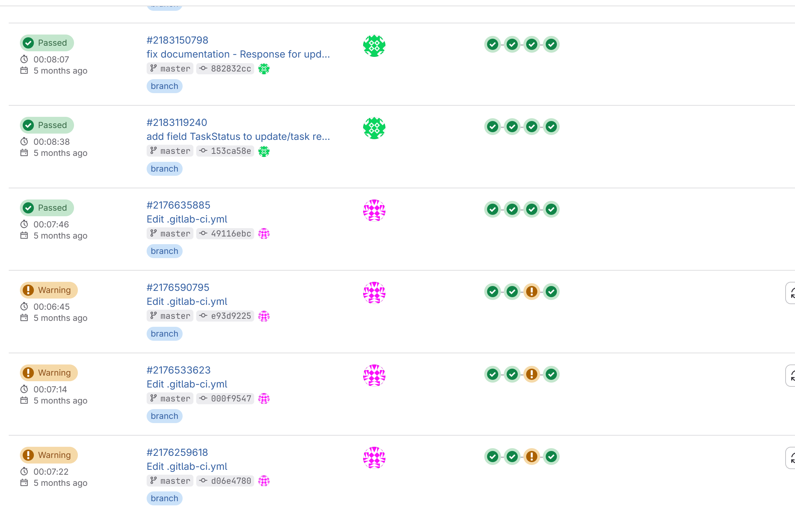
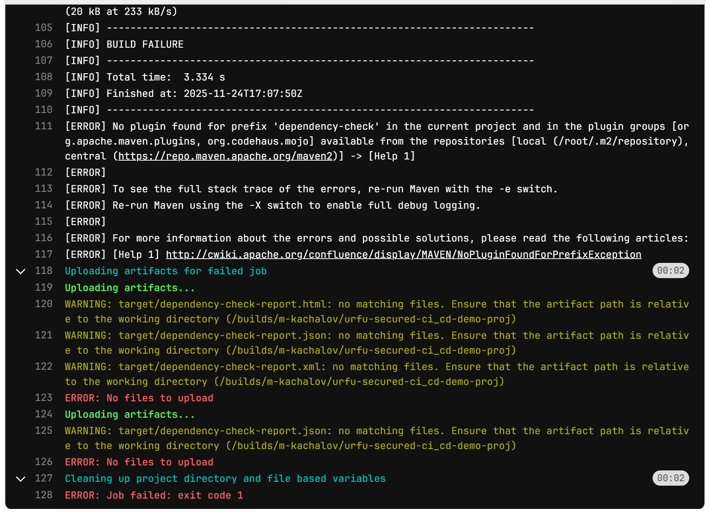
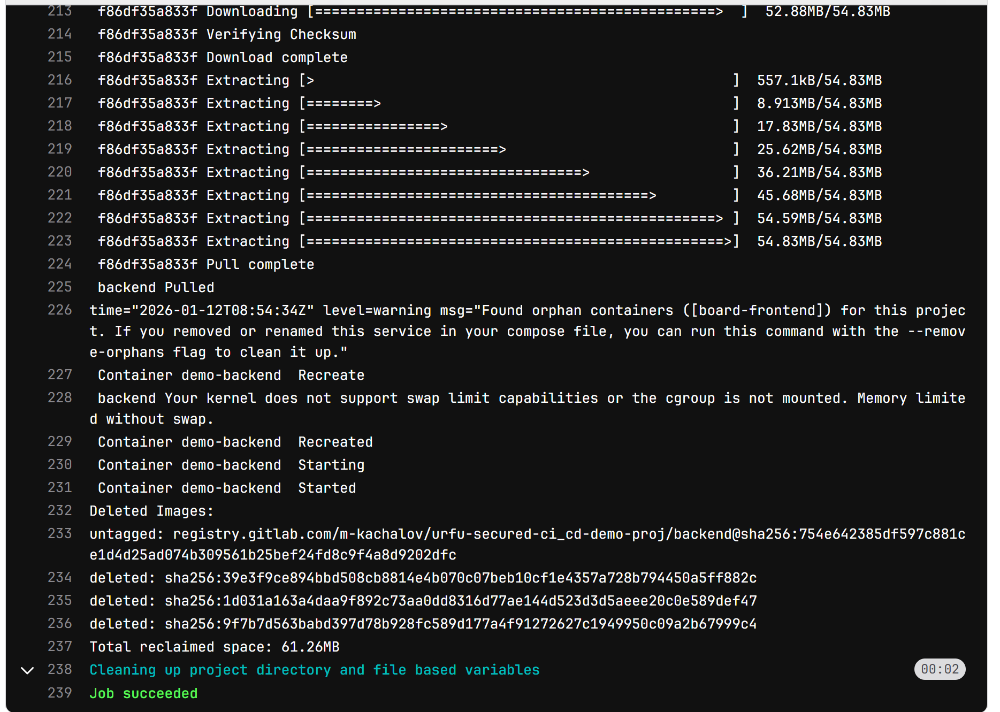

Ссылка на проект: https://gitlab.com/m-kachalov/urfu-secured-ci_cd-demo-proj
Приложение с одного из учебных проектов УрФУ, где я отвечал за ci-пайплайн.

Настроен полный цикл ci-cd, включая SCA и SAST тестирование.
Пайплайнов там как успешных 
, так и неуспешных достаточно. 
,
